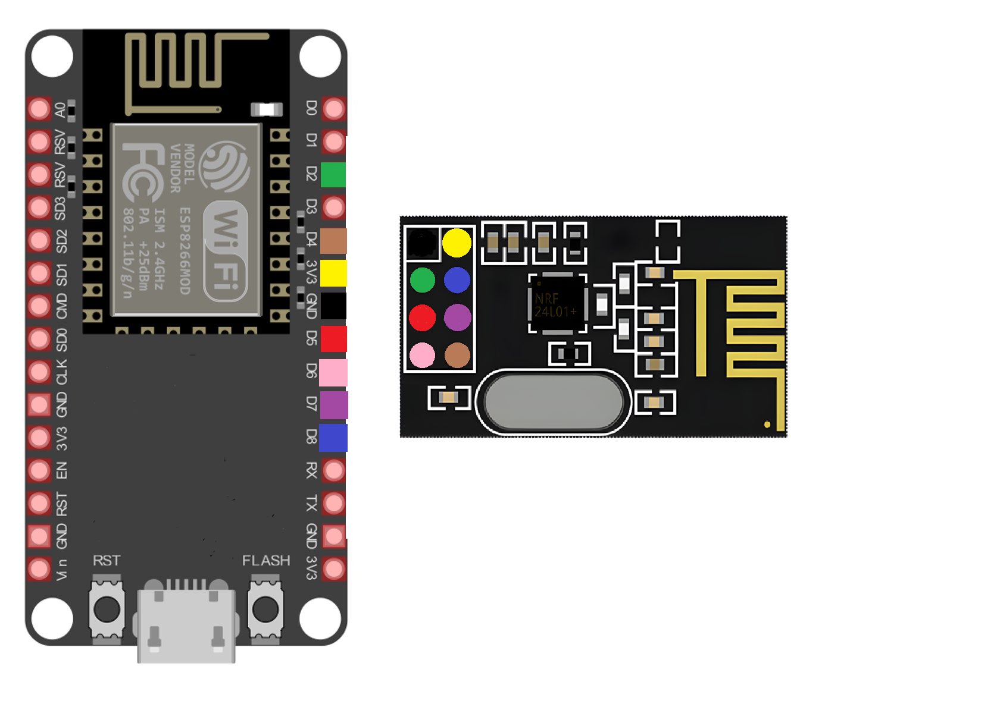

1. If you realise projects using ESP-NOW library for wireless connections you only need esp8266 boards.

1. Setup Toolchain and get ESP8266_RTOS_SDK. Follow instructions: https://docs.espressif.com/projects/esp8266-rtos-sdk/en/latest/get-started/index.html

2. If you realise projects using Esp8266 Node MCU boards and nRF24l01+ chips for wireless connections you should connect Esp8266 with nRF24l01+ as follows:
.

3. Go to subdirectories with examples for more information.
