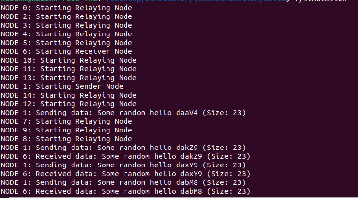

# Mesh network linux simulator
Purpose of this project is to provide simulation framework for universal MeshDirectedDiffusion library. Thanks to this framework, projects based on MeshDirectedDiffusion library can be easily prototyped and tested without having to use real microcontrollers. Framework also provides quick method to test changes in mesh library itself.

Running simulation contains process of the server, which acts as layer for communication beetween network nodes, and processes for each node in the network. Project allows to modify network topology and to implement simulated nodes which are calling MeshDirectedDiffusion API.

## Setting up and running simulation

Tested in linux ubuntu:

1. Make sure cmake is intalled:
```
	sudo apt install cmake
```
2. Install mbedtls library:
```
sudo apt update
sudo apt install libmbedtls-dev
```
3. Place MeshDirectedDiffusion library to this directory and copy whole content of MeshDirectedDiffusion/InterfaceFunctions/linux-simulFiles one directory lower into MeshDirectedDiffusion/InterfaceFunctions (and merge their include directories):
```
	cp MeshDirectedDiffusion/InterfaceFunctions/linux-simulFiles/include/* MeshDirectedDiffusion/InterfaceFunctions/include/
	```
	```
	find MeshDirectedDiffusion/InterfaceFunctions/linux-simulFiles/ -maxdepth 1 -type f -exec cp {} MeshDirectedDiffusion/InterfaceFunctions/ \;
```
4. Go to build directory and run:
```
	cd build
	cmake ..
	make
```
5. To run simulation:
```
	./Simulation
```
6. Beginning of simulation output should look something like this:   If you only see logs related to start of the nodes (lack of data received logs) it might mean that this simulation is too exhausting for your machine and you have to reduce topology size.

## Topology edition and code generation

If you want to edit simulation (topology and functionality of nodes) you have to edit simulation.c file. You can quickly generate *simulation.c* file using lisp code which will do the job. Just open *simulationcFileGenerator.lisp* file and edit topology part:
```
(defvar *input-data*
  '(
	;; (individualNodeId (neighborId0 neighborId1 neighborId2 ... ) "taskToDoName")
	(0 (1) "relayingNode")
	(1 (0 2) "senderNode")
	(2 (1 4) "relayingNode")
	(3 (4) "relayingNode")
	(4 (2 3 5) "relayingNode")
	(5 (4 6 9) "relayingNode")
	(6 (4 5 7 9 10) "receiverNode")
	(7 (6 9) "relayingNode")
	(8 (9) "relayingNode")
	(9 (5 6 7 8) "relayingNode")
	(10 (6 11) "relayingNode")
	(11 (10 12 13) "relayingNode")
	(12 (11 14) "relayingNode")
	(13 (11) "relayingNode")
	(14 (12) "relayingNode")
    )
)
```

There is 15 nodes in this topology. As explanation, row *(1 (0 2) "senderNode")* defines node with index 1. Node 1 is capable to pass data to neighbor nodes 0 and 2. It's working task is called "senderNode" which can be found in *simulNodes/senderNode.c* file.

After modifing topology schema, you have to run whole code from *simulationcFileGenerator.lisp* file in lisp compiler (for example: https://rextester.com/l/common_lisp_online_compiler) and copy output to *simulation.c* file.

## Adding new functionalities for nodes
1. To add new functionalities for nodes (you can find the simplest example functionality in *simulNodes/relayingNode.c* file) you have to edit *nodeStarter.c* file by adding new "elseif":
```
			...
	if (strcmp(task, "relayingNode") == 0) {
 			linuxSimulationPrint("Starting Relaying Node\n" );
 			relayingNode();
		} else if (strcmp(task, "newNode") == 0) {
 			linuxSimulationPrint("Starting new node\n" );
	 		newNodeImplementation();
		}
			...
```
2. String "newNode" has to match with string in "taskToDoName" collumn in lisp generator code. For example:
```
'(
;; (individualNodeId (neighborId0 neighborId1 neighborId2 ... ) "taskToDoName")
(0 (1) "relayingNode")
(1 (0 2) "senderNode")
(2 (1 4) "newNode")
		...
	)
```
3. In *simulNodes/simulNodes.h* include new implementation of a node:
```
			...
		void relayingNode();
		void newNodeImplementation();
			...
```
4. Add new executable file to *CmakeLists.txt* file:
```
add_executable( ... simulNodes/relayingNode.c ... simulNodes/newNodeImplementation.c)
```
5. Lastly implement *void newNodeImplementation()* in newly created *simulNodes/newNodeImplementation.c* file. For network interaction use MeshDirectedDiffusion API functions.
